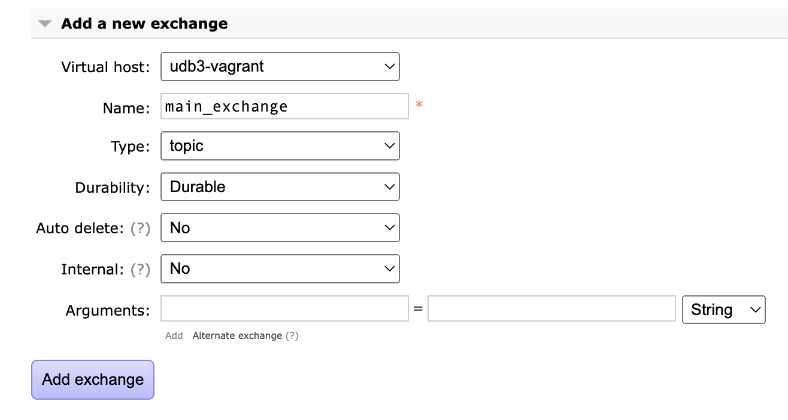

# Projectaanvraag with Docker

## Prerequisite
- Install Docker Desktop
- appconfig: you'll have to clone [appconfig](https://github.com/cultuurnet/appconfig) in the same folder as where you will clone [projectaanvraag-silex](https://github.com/cultuurnet/projectaanvraag-silex)

## Configure

### Configuration setup
To get or update the configuration files, run the following command in the root of the project
```
$ make config
```

## Start

### Docker

Start the docker containers with the following command. Make sure to execute this inside the root of the project so the `.env` can be used.
```
$ make up
```

**Warning:** If you also have the `udb3-backend` container running, you will get errors because of colliding port numbers for MySQL and several other services.
You can fix this with adding to the `.env` file:
```
FORWARD_PHP_PORT=8001
FORWARD_DB_PORT=3308
FORWARD_REDIS_PORT=6381
FORWARD_RABBITMQ_PORT=5673
FORWARD_RABBITMQ_MANAGEMENT_PORT=15673
FORWARD_MONGODB_PORT=27018
```

### RabbitMQ

Create an exchange called `main_exchange` on host `udb3-vagrant` by accessing the RabbitMQ management interface on http://host.docker.internal:15672/.
If you had to change the ports the correct url is http://host.docker.internal:15673/.

The credentials can be found in `config.yml`.




### Migrations & Composer packages

To install all composer packages & migrate the database, run the following command:
```
$ make init
```

### CI

To execute all CI tasks, run the following command:
```
$ make ci
```

### Testing if it works
An example url you can use to test if the application is working is  http://localhost:8000/culturefeed/oauth/connect (or http://localhost:8001/culturefeed/oauth/connect if you changed ports).
This should end up at a login screen for uitid.
